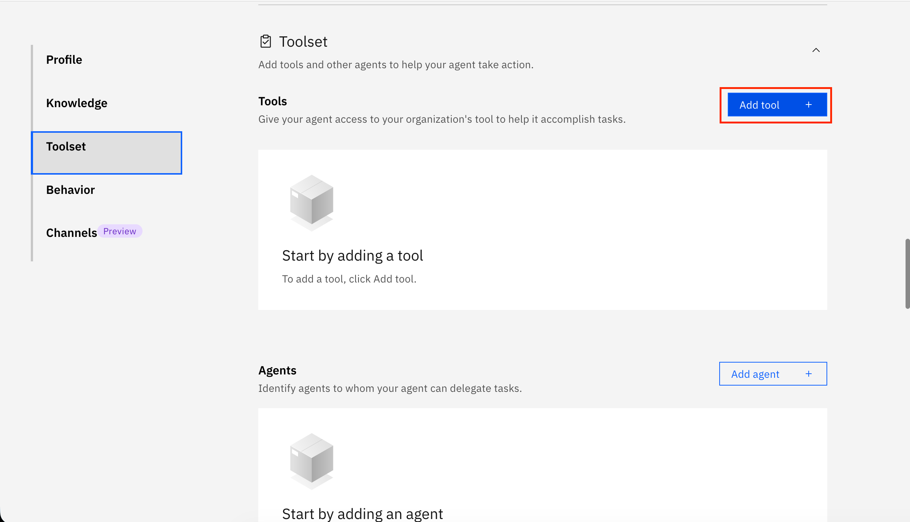
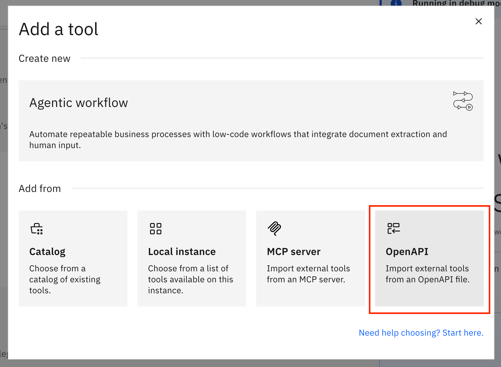
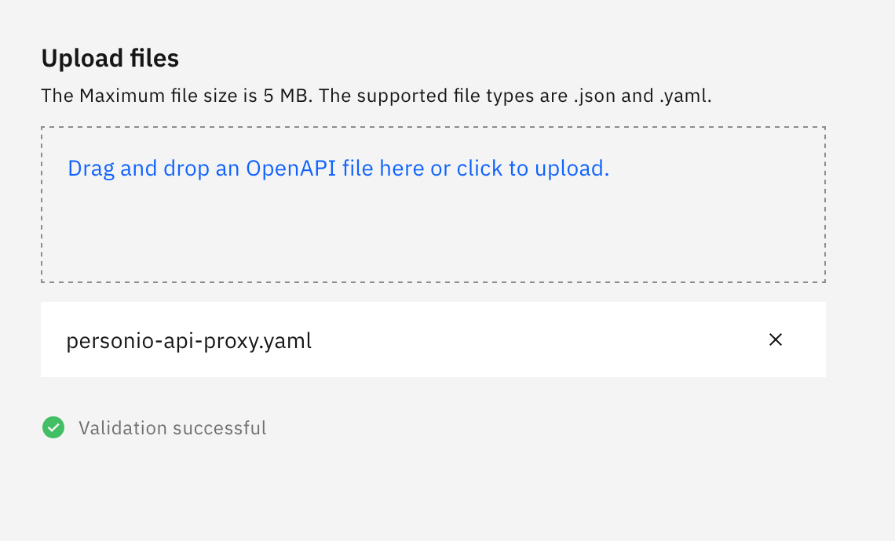
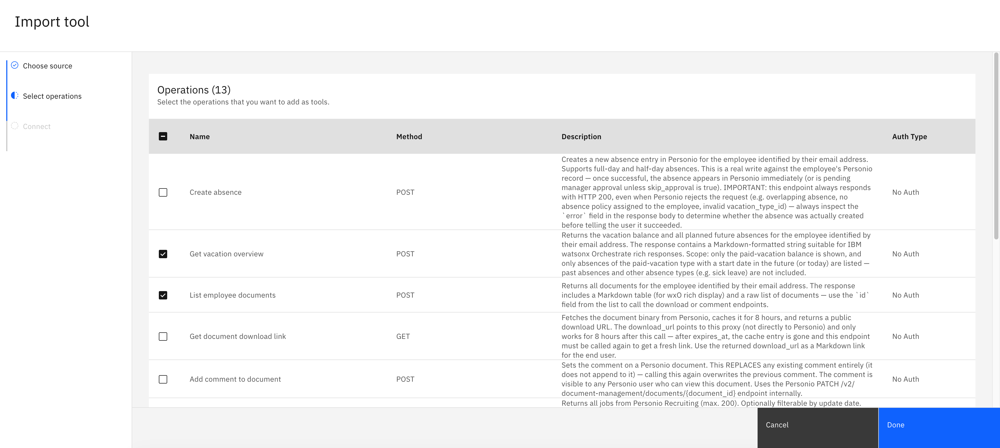
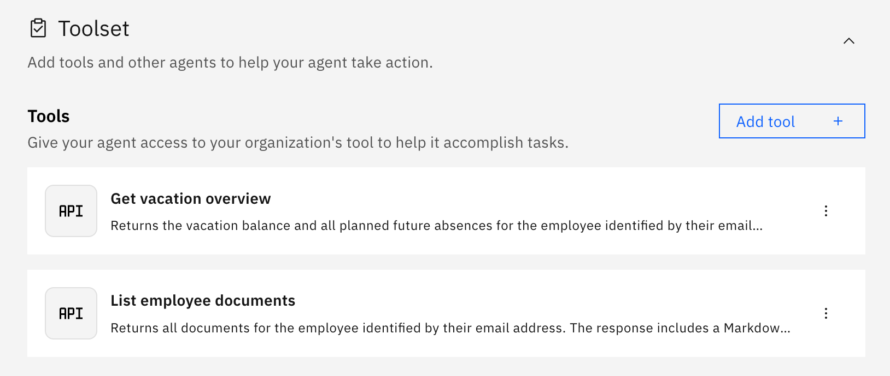
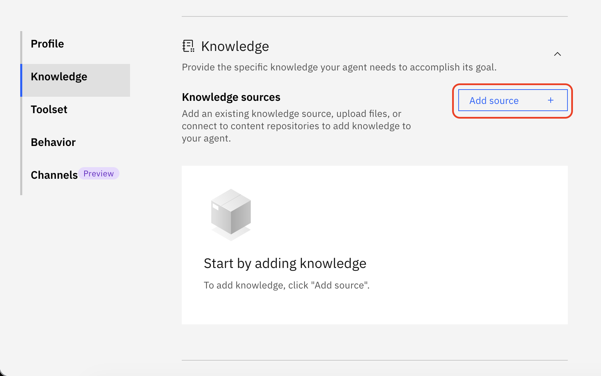
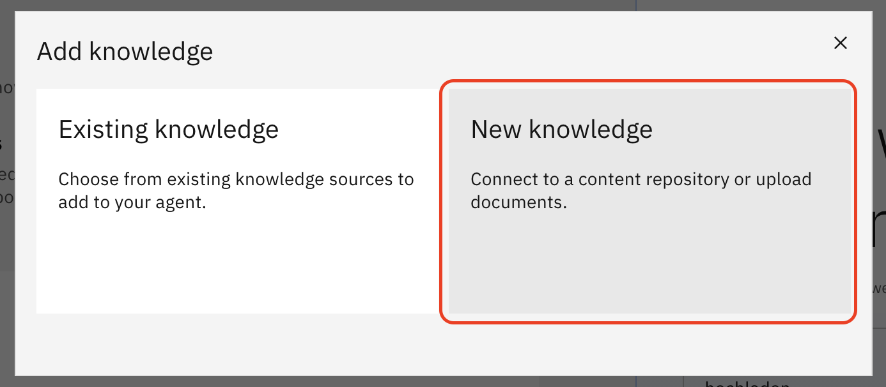
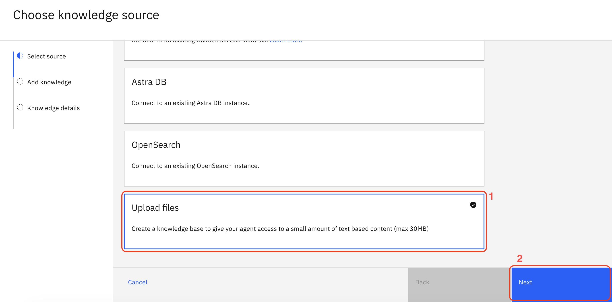
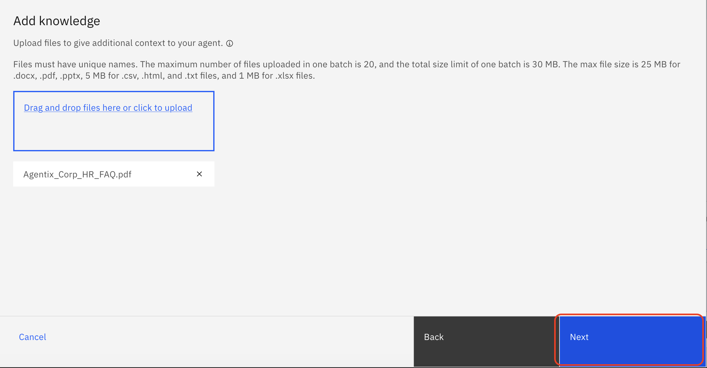
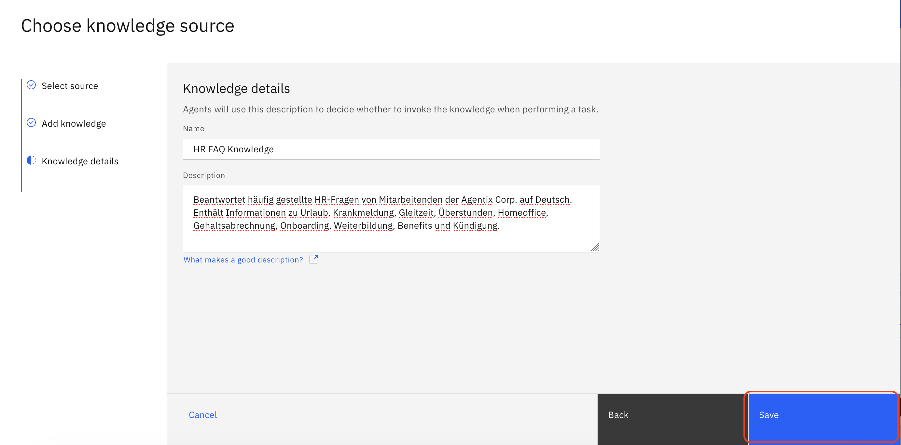

<br/><br/>

# KI-Agenten im HR

**Tag 2 · 24. Juni · IBM Ehningen**

Ein gemeinsames Hands-on-Lab von **IBM** und **SVA**

> Willkommen! In diesem Repository finden Sie alles, was Sie für den zweiten Tag des Bootcamps brauchen: Beispiel-Use-Cases, importierbare Tools (OpenAPI-Spezifikationen) und eine Schritt-für-Schritt-Anleitung, um Ihren ersten eigenen HR-Agenten in **IBM watsonx Orchestrate (wxO)** zu bauen – inklusive Anbindung an eine **Personio**-Umgebung.

---

## Inhaltsverzeichnis

- [KI-Agenten im HR](#ki-agenten-im-hr)
  - [Inhaltsverzeichnis](#inhaltsverzeichnis)
  - [1. Was haben wir heute vor?](#1-was-haben-wir-heute-vor)
  - [2. Was ist Personio – und wie funktioniert die Anbindung?](#2-was-ist-personio--und-wie-funktioniert-die-anbindung)
    - [Kurz: Was ist Personio?](#kurz-was-ist-personio)
    - [Wie funktioniert die Anbindung?](#wie-funktioniert-die-anbindung)
    - [Einrichtung – machen wir live gemeinsam 🤝](#einrichtung--machen-wir-live-gemeinsam-)
  - [3. Wie integriere ich die bereitgestellten Tools?](#3-wie-integriere-ich-die-bereitgestellten-tools)
    - [Schritt-für-Schritt-Anleitung](#schritt-für-schritt-anleitung)
  - [4. Wissensdatenbank: HR-FAQ \& Richtlinien testen](#4-wissensdatenbank-hr-faq--richtlinien-testen)
    - [Schritt-für-Schritt-Anleitung](#schritt-für-schritt-anleitung-1)
  - [5. Beispiel-Use-Cases](#5-beispiel-use-cases)
    - [Use-Case 1: __](#use-case-1-)
    - [Use-Case 2: __](#use-case-2-)
    - [Use-Case 3: __](#use-case-3-)
  - [Hilfreiche Links](#hilfreiche-links)

---

## 1. Was haben wir heute vor?

Heute bauen Sie **selbst** eigene KI-Agenten in watsonx Orchestrate – mit Fokus auf **HR-Automatisierung**.

Aufbauend auf den Grundlagen vom ersten Tag geht es heute darum, selbst kreativ zu werden: Sie verstehen, wie ein Agent *denkt*, *Tools auswählt* und *Aktionen* in einem Fremdsystem ausführt. Als Spielwiese dient eine angebundene Personio-Umgebung, in der Ihr Agent z. B. Mitarbeiterdaten nachschlagen oder Urlaub beantragen kann.

**Der Ablauf heute:**

1. **Grundlagen & Setup** – Wir richten gemeinsam Ihren Zugang ein und verbinden Ihre Umgebung mit Personio (siehe [Abschnitt 2](#2-was-ist-personio--und-wie-funktioniert-die-anbindung)).
2. **Tools importieren** – Sie binden die bereitgestellten Tools über eine OpenAPI-Spezifikation an Ihren Agenten an (siehe [Abschnitt 3](#3-wie-integriere-ich-die-bereitgestellten-tools)).
3. **Eigenen Agenten entwerfen** – Sie gestalten Rolle, Anweisungen (Instructions) und Verhalten Ihres Agenten selbst. Die [Beispiel-Use-Cases](#5-beispiel-use-cases) dienen Ihnen als Inspiration und Startpunkt – nicht als Vorgabe.
4. **Testen & iterieren** – Sie probieren Ihren Agenten im Chat aus, beobachten seine Reasoning-Schritte und schärfen Instructions und Tool-Auswahl nach.

> 💡 **Wichtig:** Die kreative Arbeit – *welchen* Agenten Sie bauen und *wie* er sich verhält – liegt bei Ihnen. IBM und SVA stellen die Infrastruktur, die Tools und die Beispiele bereit. Wir sind den ganzen Tag für Fragen vor Ort.

**Was Sie mitbringen sollten:**

- Einen Laptop mit aktuellem Browser
- Ihren Zugang zu watsonx Orchestrate (erhalten Sie vor Ort)
- Die **E-Mail-Adresse**, mit der Sie sich für das Bootcamp angemeldet haben (wird für die Personio-Anbindung benötigt – siehe unten)

---

## 2. Was ist Personio – und wie funktioniert die Anbindung?

### Kurz: Was ist Personio?

[Personio](https://www.personio.de/) ist eine weit verbreitete HR-Software. Sie bündelt typische Personalprozesse an einem Ort – u. a. **Mitarbeiterverwaltung**, **Abwesenheits- und Urlaubsmanagement**, **Recruiting** und **Gehaltsabrechnung**.

Für unser Bootcamp ist vor allem eines wichtig: Personio lässt sich von außen ansteuern. Das heißt, Ihr Agent kann auf Knopfdruck HR-Aufgaben in Personio erledigen – zum Beispiel eine Abwesenheit eintragen oder Mitarbeiterdaten nachschlagen.

### Wie funktioniert die Anbindung?

Damit Sie sich um die technischen Details nicht kümmern müssen, haben wir die Verbindung zu Personio bereits vorbereitet. Stellen Sie es sich wie einen **Vermittler** vor, der zwischen Ihrem Agenten und Personio sitzt:

```
   Ihr Agent    ───►   Vermittler   ───►   Personio
 (watsonx                                 (HR-Daten)
  Orchestrate) ◄───                 ◄───
```

Dieser Vermittler erledigt im Hintergrund die Anmeldung bei Personio und stellt Ihrem Agenten **fertige Bausteine („Tools")** bereit – jedes Tool steht für eine konkrete HR-Aktion, etwa „Create absence" oder „List applications". Sie wählen einfach aus, welche dieser Bausteine Ihr Agent nutzen darf.

**Das bedeutet für Sie:**

- Sie müssen sich **nicht mit Passwörtern, Zugängen oder Technik** beschäftigen – das übernimmt der Vermittler.
- Sie arbeiten mit **verständlichen Bausteinen**.
- Sie können sich ganz auf das konzentrieren, was zählt: **Welche HR-Aufgabe soll Ihr Agent übernehmen?**

### Einrichtung – machen wir live gemeinsam 🤝

> **Wichtiger Hinweis:** Die Verbindung Ihrer Umgebung mit Personio richten wir **gemeinsam vor Ort** ein – Sie müssen hier nichts vorbereiten.

Die Zuordnung Ihres Zugangs erfolgt über **genau die E-Mail-Adresse, mit der Sie sich für das Bootcamp angemeldet haben**. Halten Sie sie also bereit. Wir gehen den Einrichtungsschritt Schritt für Schritt zusammen durch, damit am Ende jede:r Teilnehmer:in eine funktionierende Personio-Anbindung hat.

---

## 3. Wie integriere ich die bereitgestellten Tools?

Die Tools werden über eine **OpenAPI-Spezifikation** (`.yaml`-Datei) in Ihren Agenten importiert. Das funktioniert direkt in der Oberfläche von watsonx Orchestrate – ganz ohne Code.

> 📄 **Die Datei, die Sie brauchen:** [`personio-api-proxy.yaml`](./personio-api-proxy.yaml)

### Schritt-für-Schritt-Anleitung

**Schritt 1 – Agenten öffnen und zum Toolset wechseln**

Öffnen Sie Ihren Agenten im Agent-Builder von watsonx Orchestrate und scrollen Sie zum Bereich **Toolset**. Klicken Sie dort auf **Add tool +**.



---

**Schritt 2 – „Import" über OpenAPI wählen**

Wählen Sie im erscheinenden Dialog die Option zum **Import über eine OpenAPI-Spezifikation** (**"OpenAPI"**).



---

**Schritt 3 – YAML-Datei hochladen**

Laden Sie die bereitgestellte Datei **`personio-api-proxy.yaml`** hoch (per Drag-and-drop oder über den Datei-Dialog).



---

**Schritt 4 – Tools (Operationen) auswählen**

watsonx Orchestrate liest die Spezifikation ein und zeigt Ihnen alle verfügbaren **Operationen** als Tools an. Setzen Sie die Haken bei den Tools, die Ihr Agent verwenden soll.

> 💡 **Tipp:** Importieren Sie nur die Tools, die Ihr Use-Case wirklich braucht. Ein fokussiertes Toolset hilft dem Agenten, die passende Aktion zuverlässiger zu wählen.



---

**Schritt 5 – Hinzufügen & testen**

Bestätigen Sie die Auswahl (**"Done"**). Die Tools erscheinen nun im Toolset Ihres Agenten. Testen Sie anschließend im Chat, ob Ihr Agent die Tools im passenden Moment aufruft.



---

> ✅ **Geschafft!** Ihr Agent kann ab jetzt über die importierten Tools mit Personio interagieren.
>
> Wenn ein Tool nicht wie erwartet aufgerufen wird, prüfen Sie zuerst die **Tool-Beschreibung** und die **Instructions** Ihres Agenten – sie sind der wichtigste Hebel, damit der Agent versteht, *wann* er *welches* Tool nutzen soll.

---

## 4. Wissensdatenbank: HR-FAQ & Richtlinien testen

Neben den Tools (die *Aktionen* in Personio ausführen) kann Ihr Agent auch **Fragen beantworten** – auf Basis einer Wissensdatenbank (**Knowledge Base**).

Dafür liegt in diesem Repository eine **FAQ-Datei** bereit:

> 📄 **Datei:** [`Agentix_Corp_HR_FAQ.pdf`](./Agentix_Corp_HR_FAQ.pdf)

Sie enthält typische **HR-FAQs und Richtlinien** (z. B. Fragen rund um Urlaub, Krankmeldung, Arbeitszeiten oder interne Abläufe). Sie können diese Datei in eine **Knowledge Base** Ihres Agenten laden und damit ausprobieren, wie gut Ihr Agent passende Antworten findet und formuliert.

So lassen sich beide Bausteine kombinieren:

- **Tools** → für *Aktionen* (etwas in Personio tun)
- **Knowledge Base** → für *Wissen* (Fragen zu Richtlinien & Abläufen beantworten)

### Schritt-für-Schritt-Anleitung

> 💡 **Hinweis:** Die FAQ stammt von der fiktiven Testfirma **Agentix Corp.** – bitte diesen Namen auch beim Anlegen der Knowledge Base verwenden, damit der Agent den Kontext kennt.

---

**Schritt 1 – Knowledge-Bereich öffnen**

Klicken Sie im Agent Builder links in der Navigation auf **Knowledge**.

---

**Schritt 2 – Neue Quelle hinzufügen**

Klicken Sie auf den Button **Add source +**.



---

**Schritt 3 – „New knowledge" wählen**

Wählen Sie im Dialog die Option **New knowledge**.



---

**Schritt 4 – Upload-Option wählen**

Klicken Sie unten auf **Upload files** und bestätigen Sie mit **Next**.



---

**Schritt 5 – FAQ-Datei hochladen**

Laden Sie die Datei **`Agentix_Corp_HR_FAQ.pdf`** hoch und klicken Sie anschließend auf **Next**.

> 📄 **Datei:** [`Agentix_Corp_HR_FAQ.pdf`](./Agentix_Corp_HR_FAQ.pdf)



---

**Schritt 6 – Name und Beschreibung vergeben**

Geben Sie der Knowledge Base einen aussagekräftigen **Namen** (z. B. *Agentix Corp HR FAQ*) und eine **detaillierte Beschreibung**, damit der Agent weiß, welche Inhalte darin enthalten sind – z. B.:

> *Enthält HR-FAQs und Unternehmensrichtlinien der Agentix Corp, u. a. zu Urlaub, Krankmeldung, Arbeitszeiten und internen Abläufen.*

Klicken Sie abschließend auf **Save**.



---

> ✅ **Geschafft!** Die Knowledge Base ist angelegt und steht Ihrem Agenten ab sofort zur Verfügung.
>
> Testen Sie im Chat, ob Ihr Agent Fragen zu HR-Richtlinien nun auf Basis der FAQ beantwortet. Wenn die Antworten ungenau sind, lohnt es sich, die **Beschreibung der Knowledge Base** zu schärfen – sie ist der wichtigste Hinweis für den Agenten, *wann* er dieses Wissen nutzen soll.

---

## 5. Beispiel-Use-Cases

Die folgenden Use-Cases dienen Ihnen als Inspiration und Startpunkt. Fühlen Sie sich nicht daran gebunden – kombinieren, erweitern oder erfinden Sie gerne eigene Szenarien.

### Use-Case 1: AskHR – Richtlinien, Dokumente & Urlaub

> Mitarbeitende stellen HR-Fragen, rufen Dokumente ab oder beantragen Urlaub – alles in einem Gespräch, ohne das System wechseln zu müssen.

- **Was der Agent tut:** Beantwortet Fragen zu HR-Richtlinien aus der Knowledge Base (z. B. Urlaubsanspruch, Homeoffice-Regelung, Kündigungsfristen). Listet Mitarbeiterdokumente auf, stellt zeitlich begrenzte Download-Links bereit und pflegt Kommentare. Trägt Abwesenheiten direkt in Personio ein und zeigt den aktuellen Urlaubskontostand an.
- **Benötigte Tools:** Knowledge Base (Agentix Corp HR FAQ), `listDocuments`, `getDocumentLink`, `commentDocument`, `createVacation`, `getVacationOverview`
- **Beispiel-Prompt:** _„Ich möchte vom 14. bis 18. Juli Urlaub nehmen – kannst du das eintragen und mir danach meinen aktuellen Kontostand zeigen?"_

### Use-Case 2: Bewerbermanagement

> Recruiter behalten den Überblick über alle Kandidaten und Bewerbungen – der Agent liefert Status und Pipeline-Verlauf auf Anfrage.

- **Was der Agent tut:** Sucht und listet Kandidaten und Bewerbungen nach verschiedenen Kriterien (Name, E-Mail, Stelle, Datum). Zeigt Details zu einzelnen Bewerbungen und den vollständigen Stage-Verlauf an, um den Fortschritt in der Recruiting-Pipeline nachvollziehen zu können.
- **Benötigte Tools:** `listCandidates`, `listApplications`, `getApplication`, `getApplicationStages`
- **Beispiel-Prompt:** _„Zeig mir alle Bewerbungen für die Stelle DevOps Engineer und den aktuellen Stage jedes Kandidaten."_

### Use-Case 3: RecruitingAgent – Stellenausschreibungen erstellen

> Aus einem bestehenden Job-Profil in Personio wird in Sekunden eine vollständige, deutsche Stellenanzeige generiert und zur Veröffentlichung vorbereitet.

- **Was der Agent tut:** Ruft offene Stellen und deren Details aus Personio ab, generiert auf dieser Basis strukturierte Stellenanzeigentexte (Unternehmensvorstellung, Aufgaben, Anforderungsprofil, Benefits) und simuliert die Veröffentlichung auf LinkedIn. Die generierten Texte sind ein erster Entwurf und sollten vor echter Verwendung geprüft werden.
- **Benötigte Tools:** `listJobs`, `getJob`, `getJobPostingBlocks`, `publishJobToLinkedin`
- **Hinweis:** `publishJobToLinkedin` ist ein Demo-Endpunkt – es wird keine echte LinkedIn-Anzeige erstellt.
- **Beispiel-Prompt:** _„Erstelle eine Stellenanzeige für unsere offene Senior-DevOps-Stelle und bereite die LinkedIn-Veröffentlichung vor."_

### Use-Case 4: HR datenbasiert steuern und Risiken früh erkennen

> Recruiting-Verantwortliche behalten die Pipeline im Blick: Der Agent bündelt Bewerbungs- und Kandidatendaten aus Personio und macht Engpässe auf einen Blick sichtbar.

- **Was der Agent tut:** Listet offene Stellen und zugehörige Bewerbungen auf, zeigt den aktuellen Stage je Kandidat und hebt Auffälligkeiten hervor (z. B. Bewerbungen, die lange in derselben Phase verweilen). Auf Wunsch kann auch der Urlaubskontostand einzelner Mitarbeitender abgefragt werden.
- **Benötigte Tools:** `listJobs`, `listApplications`, `getApplication`, `getApplicationStages`, `listCandidates`, `getVacationOverview`
- **Beispiel-Prompt:** _„Welche Bewerbungen für die Stelle Senior Backend Developer sind noch offen, und in welchem Stage befinden sie sich gerade?"_

---

## Hilfreiche Links

- **watsonx Orchestrate – Produkt-Doku:** https://www.ibm.com/docs/en/watsonx/watson-orchestrate/base
- **Personio:** https://sva-ibm-demo.app.personio.com/

---

<sub>Bei Fragen während des Bootcamps: Sprechen Sie Ihr IBM- oder SVA-Team direkt an. Viel Erfolg beim Bauen! 🚀</sub>